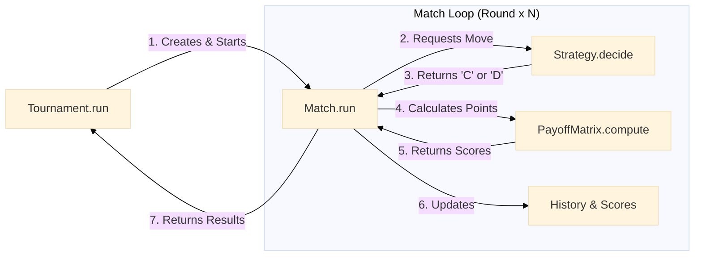

# "Prisoner's Dilemma" Project Architecture

This document describes the high-level architecture of the simulator, highlighting the interactions between the main modules: `core`, `strategies`, and `tournaments`.

## Interaction Diagram

The following diagram shows how classes connect to each other during the execution of a tournament.
The flow is hierarchical: the Tournament orchestrates the Matches, which orchestrate the Strategies and use the Payoff Matrix to calculate scores.

---

## Main Modules

### 1. Core (`core/`)
Contains the fundamental and agnostic logic of the game.

*   **`Match` (`match.py`)**: 
    *   **Role**: It is the fundamental unit of the game.
    *   **Function**: Manages the interaction between two agents for a fixed number of rounds.
    *   **State**: Maintains the state (move history, current scores).
    *   **Responsibility**: Ask agents for moves, calculate payoffs via `PayoffMatrix`, and return final data.

*   **`PayoffMatrix` (`payoff.py`)**:
    *   **Role**: Defines the scoring rules of the Prisoner's Dilemma.
    *   **Behavior**: It is a pure class, with no internal state changing during the game.
    *   **I/O**: Input: Pair of moves. Output: Pair of scores.

### 2. Strategies (`strategies/`)
Defines the intelligence of the agents.

*   **`Strategy` (Abstract)**:
    *   **Role**: Base interface for all bots.
    *   **Requirement**: Every strategy must implement the `decide(opponent_history)` method.
    
*   **Implementations**:
    *   **Basic**: Static or random strategies (`AlwaysCooperate`, `AlwaysDefect`, `Random`).
    *   **Advanced**: Reactive strategies like `TitForTat`.

### 3. Tournaments (`tournaments/`)
Manages large-scale simulation.

*   **`RoundRobinTournament`**:
    *   **Role**: Organizes a "round-robin" tournament.
    *   **Process**:
        1.  Generates all possible pairs of players.
        2.  Instantiates and runs a `Match` object for each pair.
        3.  Collects and aggregates results to determine winners and global statistics.

## Typical Execution Flow

1.  The user configures a list of **Strategies** and a **PayoffMatrix**.
2.  The user instantiates a **RoundRobinTournament**.
3.  The tournament creates **Match** instances for each unique pair.
4.  Each **Match** runs a cycle of rounds:
    *   Queries strategies (`decide`).
    *   Calculates points (`compute`).
    *   Saves history.
5.  The tournament collects all results and produces rankings.
