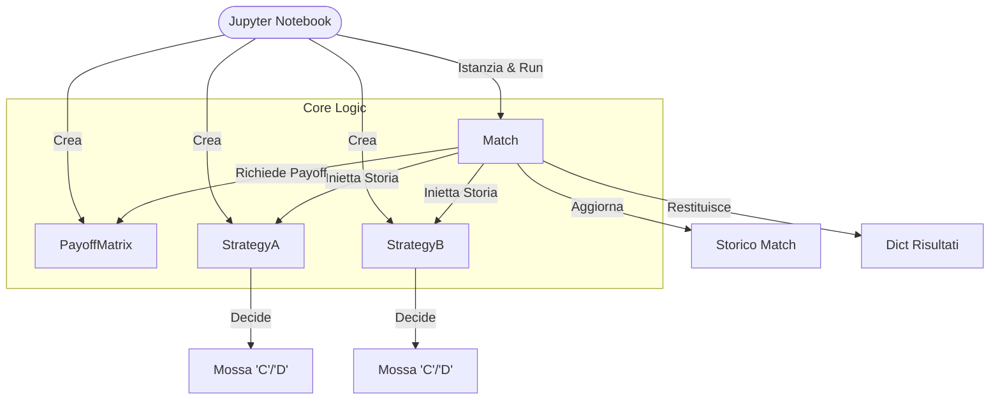

# Guida Tecnica allo Sviluppo (Developer Guide)

Questo documento funge da **manuale operativo** per l'implementazione del progetto "Prisoner's Dilemma". Include descrizioni dettagliate delle classi, i flussi di interazione e le dipendenze tra i moduli.

---

## 0. Diagramma delle Dipendenze e Flusso

Lo schema seguente visualizza come le classi interagiscono tra loro. Non ci sono dipendenze circolari (A chiama B, B chiama A): il flusso è gerarchico.

**Flusso delle Dipendenze:**
1.  `Tournaments` DIPENDE DA `Match` e `Strategy`.
2.  `Match` DIPENDE DA `Strategy` (interfaccia) e `PayoffMatrix`.
3.  `Strategy` e `PayoffMatrix` sono INDIPENDENTI (Componenti foglia).

---

## 1. Specifica Dettagliata dei File

### `core/payoff.py`

*   **Classe**: `PayoffMatrix`
*   **Ruolo**: Giudice Imparziale. Conosce solo le regole del punteggio.

#### Metodi

1.  **`__init__(self, T=5, R=3, P=1, S=0)`**
    *   **Descrizione**: Inizializza i valori della matrice.
    *   **Input**: Interi rappresentanti Temptation, Reward, Punishment, Sucker.
    *   **Chiamato da**: Utente nel Notebook o `Tournament`.

2.  **`compute(self, move_a, move_b)`**
    *   **Descrizione**: Dato un paio di mosse, restituisce i punti corrispondenti.
    *   **Input**: Due stringhe ('C' o 'D').
    *   **Output**: Tupla `(score_a, score_b)`.
    *   **Chiamato da**: `Match.play_round()`. Questo metodo è il "motore" che traduce le decisioni in numeri.
    *   **Logica**:
        *   Uguali ('C', 'C') -> (R, R)
        *   Uguali ('D', 'D') -> (P, P)
        *   Diversi ('C', 'D') -> (S, T) - *Chi collabora perde*
        *   Diversi ('D', 'C') -> (T, S) - *Chi defeziona vince*

---

### `core/match.py`

*   **Classe**: `Match`
*   **Ruolo**: Arbitro e Cronista. Inietta le informazioni ai giocatori e registra cosa fanno.

#### Metodi

1.  **`__init__(self, player_a, player_b, payoff_matrix)`**
    *   **Descrizione**: Prepara il tavolo da gioco.
    *   **Input**: Due istanze di `Strategy` (già inizializzate) e una `PayoffMatrix`.
    *   **Stato Iniziale**: Azzera punteggi e storici. **Nota**: Non accetta storici pregressi in input, parte sempre da zero.

2.  **`play_round(self)`**
    *   **Descrizione**: Esegue un singolo passo temporale (t).
    *   **Chiamato da**: `Match.run()`.
    *   **Flusso Interno**:
        1.  **Richiesta Decisioni**: Chiama `decide` sui giocatori, *incrociando* le storie: a `player_a` passa la storia di B, e viceversa. Questo è cruciale: ogni giocatore vede solo cosa ha fatto l'altro.
        2.  **Calcolo Punti**: Invoca `payoff_matrix.compute` con le mosse appena ottenute.
        3.  **Salvataggio**: Appende le mosse alle liste `history` e somma i punti agli `score`.
    *   **Output**: Tupla con lo snapshot del round.

3.  **`run(self, rounds=100)`**
    *   **Descrizione**: Loop principale della simulazione.
    *   **Output**: Dizionario strutturato contenente nomi dei giocatori, punteggi finali e l'intero storico mosse. Questo dizionario è il "prodotto finito" pronto per essere analizzato (es. convertito in DataFrame Pandas).

---

### `strategies/base.py`

*   **Classe**: `Strategy` (Abstract)
*   **Ruolo**: Contratto. Definisce cosa *è* un giocatore.

#### Metodi

1.  **`__init__(self, name=None)`**
    *   **Descrizione**: Assegna un'identità al giocatore.
    *   **Logica**: Se `name` non è fornito, usa il nome della classe tramite `self.__class__.__name__`. Questo automatismo è utile nei tornei per avere log leggibili ("AlwaysCooperate" vs "TitForTat").

2.  **`decide(self, opponent_history)`** (Abstract)
    *   **Descrizione**: Il cervello della strategia.
    *   **Input**: Lista di stringhe. Rappresenta la memoria di ciò che l'avversario ha fatto finora.
    *   **Output**: Singola stringa 'C' o 'D'.
    *   **Chiamato da**: `Match.play_round()`.

---

### `strategies/basic.py`

*   **Ruolo**: Implementazioni di riferimento ("Dummy players").

**Classi**:
*   **`AlwaysCooperate`**: Ignora l'input. Ritorna sempre 'C'. Utile come benchmark (il "buono").
*   **`AlwaysDefect`**: Ignora l'input. Ritorna sempre 'D'. Benchmark (il "cattivo").
*   **`Random`**: Ignora la storia. Lancia un dado (p=0.5 default) per scegliere. Serve a verificare la robustezza delle altre strategie al rumore.

---

### `strategies/advanced.py`

*   **Ruolo**: Strategie reattive.

**Classi**:
*   **`TitForTat`**:
    *   **Logica**:
        *   Se `opponent_history` è vuota (Turno 0) -> Collabora ('C').
        *   Altrimenti -> Copia l'ultima mossa dell'avversario (`opponent_history[-1]`).
    *   **Perché è forte**: È gentile (inizia bene), provocabile (ti punisce subito), ma indulgente (ti perdona subito se torni a collaborare).

---

### `tournaments/round_robin.py`

*   **Classe**: `RoundRobinTournament`
*   **Ruolo**: Organizzatore di Tornei.

#### Metodi

1.  **`run(self, rounds_per_match)`**
    *   **Flusso**:
        1.  Genera tutte le combinazioni possibili di giocatori ($N \times (N-1) / 2$).
        2.  Per ogni coppia:
            *   Crea un NUOVO `Match`.
            *   Esegue il match per X rounds.
            *   Salva il dizionario dei risultati in una lista.
    *   **Nota Architetturale**: Il torneo non "gioca". Delega tutto a `Match`. Il suo compito è solo accoppiare i giocatori e aggregare i filetti di dati.

---

## 2. Roadmap di Corrispondenza col Notebook

| Notebook Task | File Richiesti | Stato Attuale |
| :--- | :--- | :--- |
| **1. Simulation 1vs1** | `payoff.py`, `match.py`, `strategies/basic.py` | ✅ Completato |
| **2. Round Robin** | `tournaments/round_robin.py` | ⏳ Da fare |
| **3. Evolutionary** | `tournaments/evolutionary.py` | ⏳ Da fare |
